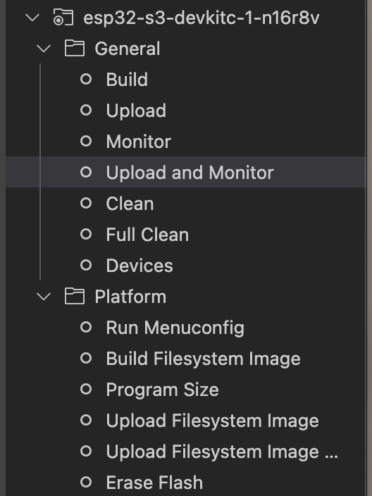

# Tinasha Speaker Recognition System

## Installation

Cần cài đặt các chương trình sau để nạp code cho ESP32 (Cụ thể là ESP32-S3 N16R8):
- [PlatformIO](https://platformio.org/install/ide?install=vscode): Extension IDE cho embedded system
- [Python 3.9](https://www.python.org/downloads/): Ngôn ngữ lập trình (Mac có sẵn k iài cũng được xĐ)
- [Cmake](https://cmake.org/download/): Công cụ để build code C/C++
    - Mac: `brew install cmake`

## Usage

Cắm cáp USB vào ESP32-S3 N16R8 và máy tính, sau đó chạy lệnh sau để nạp code vào ESP32

```bash
idf.py flash monitor
```

hoặc sử dụng platformio để thực hiện nạp code `Cmd + P -> >PlatformIO: Upload and Monitor`



## Configuration

Để thay đổi các cờ cho dự án ESP-IDF (Framework cho ESP32) sử dụng file `Kconfig.projbuild`, các cờ mẫu của dự án được đặt trong file `Kconfig.projbuild.example` chạy dự án bạn hãy sửa các cờ này cho phù hợp với mình và đưa vào file `Kconfig.projbuild` của mình. 

Các cờ dự án sẽ được lưu tại header `sdkconfig.h` và được định nghĩa theo dạng có prefix `CONFIG_<<tên cờ>>`

### Cờ hiện tại của dự án
- WIFI_SSID: Tên wifi
- WIFI_PASSWORD: Mật khẩu wifi
- MAX_TIMEOUT: Thời gian timeout khi kết nối t và gửi tín hiệu cho thiết bị ngoại vi
- MICROPHONE_RECV_BUF_SIZE: Kích thước buffer để nhận dữ liệu từ microphone